<div align="center">

# 🏛️ Credalytix: Intelligent Commercial Credit Underwriting & RAM Scorecard Engine

**Transforming Commercial Loan Appraisals from a 14-Day Ordeal into a 15-Minute Deterministic Decision**

[](https://github.com/bhatnagar-built/business-banking-showcase)
[](https://github.com/bhatnagar-built/business-banking-showcase)
[](./docs/UNDERWRITING_METHODOLOGY.md)
[](./docs/UNDERWRITING_METHODOLOGY.md)
[](./docs/INVESTOR_PITCH_DECK.md)

[**Executive Pitch Deck**](./docs/INVESTOR_PITCH_DECK.md) • [**Product One-Pager**](./docs/PRODUCT_ONE_PAGER.md) • [**Underwriting Methodology**](./docs/UNDERWRITING_METHODOLOGY.md)

</div>

---

> [!NOTE]
> ### 🧪 Product Status: Active Testing & Pilot Phase
> The Credalytix platform is currently in its **active testing and pilot phase**. The core 100-point RAM scoring engine, Tandon Method II MPBF algorithms, and multi-year financial ratio diagnostic models are undergoing comprehensive validation and stress-testing. We are actively conducting pilot evaluations with select credit underwriters, NBFCs, and financial institutions.

---

## 📌 Executive Summary

**Credalytix** is an institutional-grade B2B credit appraisal platform engineered for commercial banks, NBFCs, and SME lenders. It automates the multi-year financial statement spreading, ratio diagnostic calculations, 100-point Risk Assessment Model (RAM) scoring, Tandon Committee Working Capital (MPBF) limit assessment, and generates boardroom-ready Credit Appraisal Memos (CAM) in **under 15 minutes**.

```
┌───────────────────────────┐      ┌───────────────────────────┐      ┌───────────────────────────┐
│  Traditional Appraisal    │      │    Credalytix Engine      │      │    Business Transformation│
│  14 - 21 Days TAT         │ ───► │    < 15 Minutes TAT       │ ───► │    95% TAT Reduction      │
│  Manual Excel Spreading   │      │    Automated Spreading    │      │    Zero Calculation Error │
│  Subjective Risk Analysis │      │    100-Pt RAM Scorecard   │      │    8x Underwriter Output  │
└───────────────────────────┘      └───────────────────────────┘      └───────────────────────────┘
```

---

## 📸 Product Walkthrough & UI Showcase

### 1. Centralized Case Vault & Borrower Pipeline
Search, filter, and review active, approved, and flagged credit files with instant access to historical appraisal dossiers.
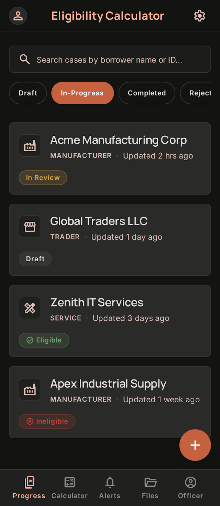

---

### 2. Streamlined Case Setup & Loan Facility Configuration
Configure borrower entity details, industry classification, vintage, facility types (Cash Credit, Overdraft, Term Loan), and requested sanction limits.
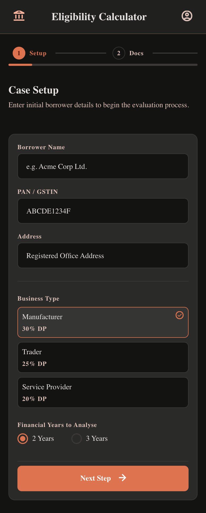

---

### 3. Intelligent Financial Statement Ingestion & Schedule Tracking
Upload audited balance sheets, P&L statements, and schedule annexures. The engine tracks document completeness in real time.
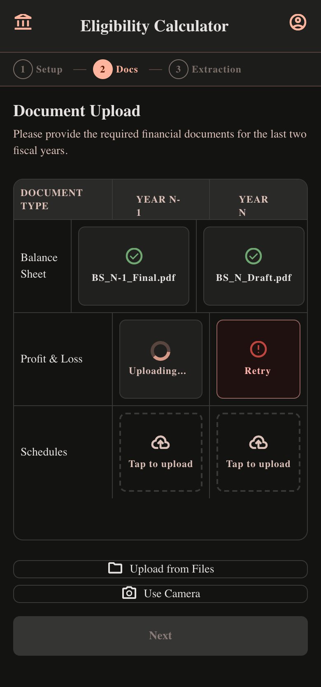

---

### 4. Multi-Year Financial Spreading & Verification
Instantly spreads granular Balance Sheet and P&L line items across FY-2, FY-1, and FY with real-time accounting balance validation ($Assets = Liabilities + Equity$).
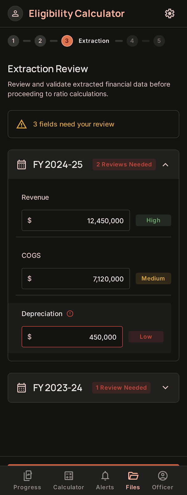

---

### 5. Multi-Year Financial Ratio Diagnostics
Side-by-side comparative analysis of Liquidity (Current Ratio, Quick Ratio), Solvency (DSCR, ISCR), Leverage (TOL/ATNW, Debt/Equity), and Efficiency (Debtor Days, Inventory Days).
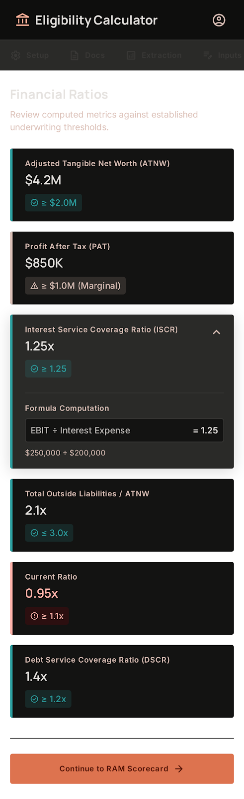

---

### 6. Calibrated 100-Point Financial-Statement-Driven RAM Scorecard
Evaluates borrower creditworthiness strictly across audited financial metrics: **Financial Performance (60 pts)**, **Capital Structure (25 pts)**, and **Business Fundamentals (15 pts)**.
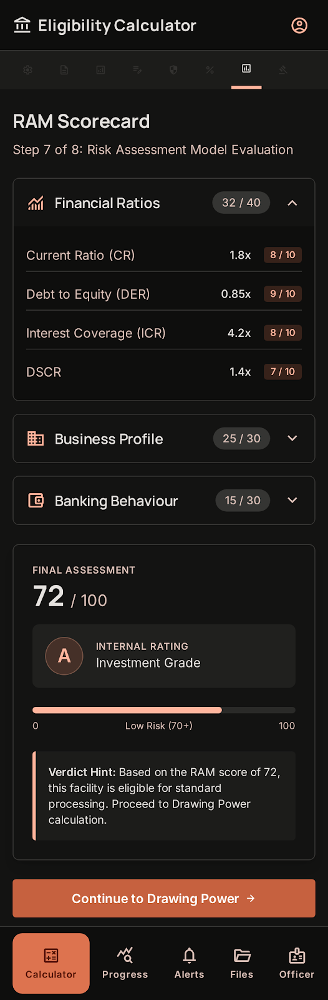

---

### 7. Regulatory Working Capital & MPBF Engine (Tandon Method II)
Computes Working Capital Gap (WCG), stipulated Net Working Capital (NWC), Maximum Permissible Bank Finance (MPBF), and sanctioned drawing power.
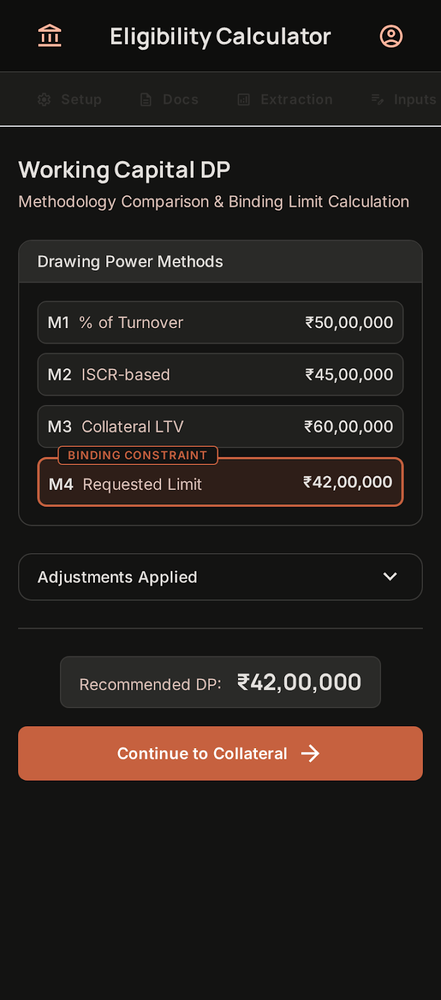

---

### 8. Collateral Assessment & SARFAESI Security Haircuts
Evaluates primary and collateral security, asset-specific LTV haircuts, and ensures required coverage thresholds are met.
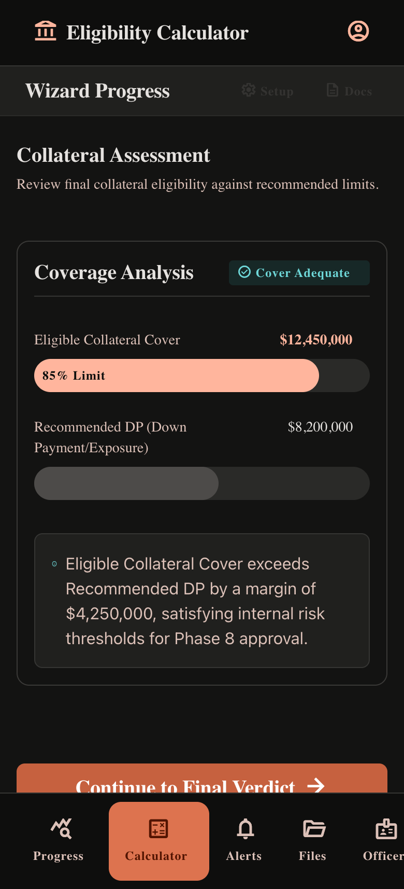

---

### 9. Unified Credit Verdict & Sanction Recommendation
Automated recommendation engine synthesizes RAM scoring, working capital limits, collateral cover, and gate conditions into an actionable credit verdict.
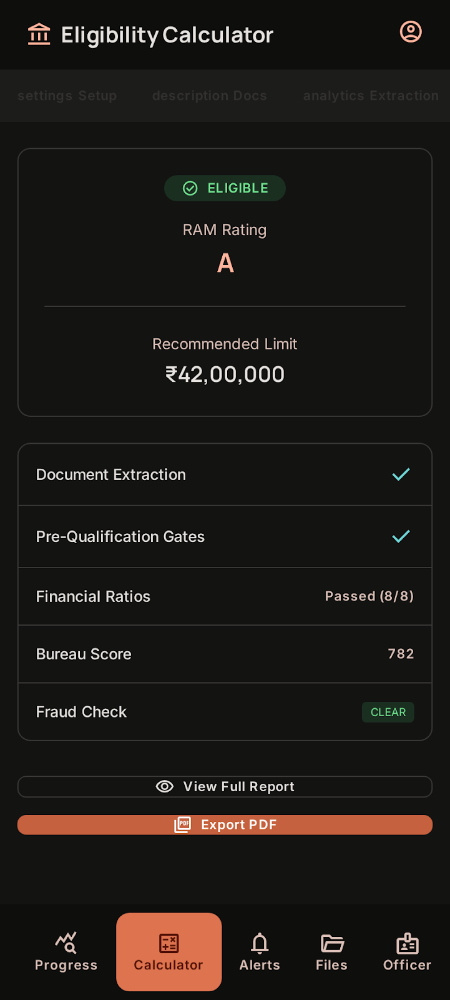

---

### 10. Instant Boardroom-Ready Credit Appraisal Memo (CAM)
Generates complete institutional credit reports ready for credit committee presentation and archival.
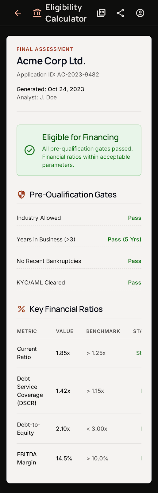

---

## 📐 System Flow & Architecture

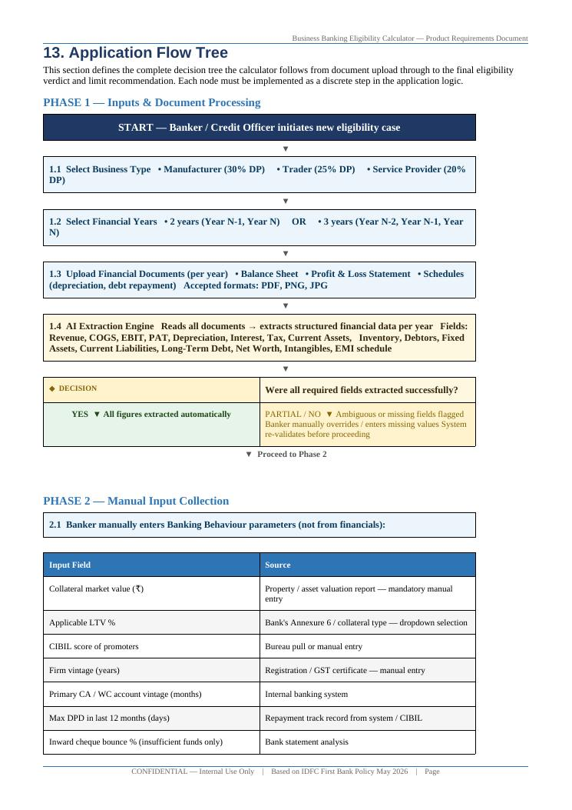

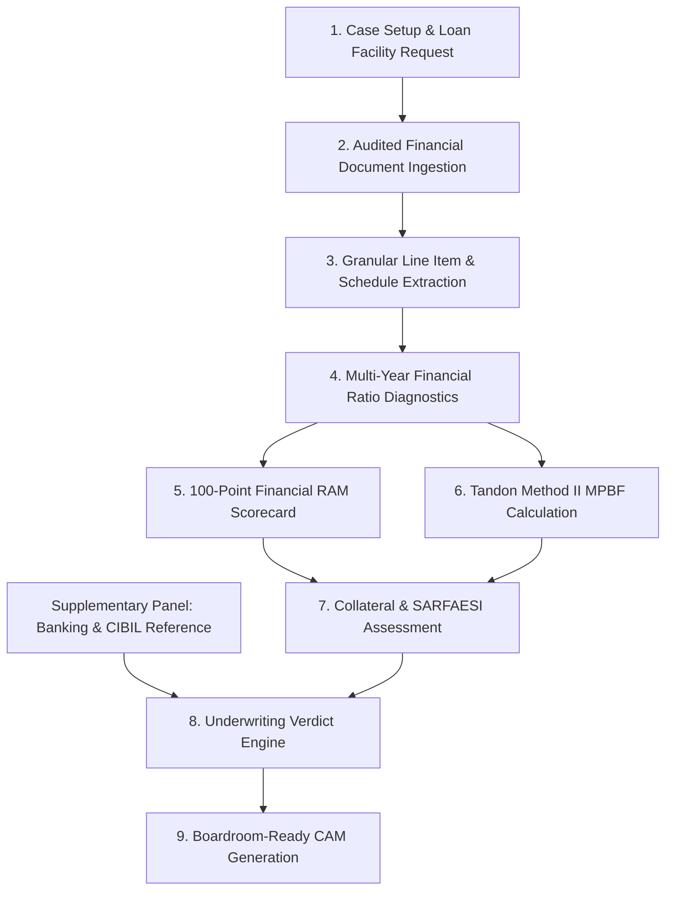

---

## 🌟 The 100-Point RAM Scorecard Framework

Unlike subjective credit scorecards, our model relies on verified audited financial figures:

| Category | Weight | Key Parameters Evaluated |
| :--- | :---: | :--- |
| **Financial Performance & Cash Flow** | **60 Points** | Current Ratio (10 pts), DSCR (10 pts), Operating Profit Margin (10 pts), ISCR (10 pts), Revenue Growth (8 pts), ROCE (7 pts), CFO to Debt (5 pts). |
| **Capital Structure & Solvency** | **25 Points** | TOL / ATNW (10 pts), Debt-to-Equity (6 pts), Tangible Net Worth Buffer (5 pts), Debt-to-EBITDA Multiple (4 pts). |
| **Business Fundamentals & Efficiency** | **15 Points** | Debtor Days (5 pts), Inventory Days (4 pts), Fixed Asset Turnover (3 pts), Operating Cycle Efficiency (3 pts). |
| **Total Benchmark** | **100 Points** | **RAM-1 (80-100)** • **RAM-2 (65-79)** • **RAM-3 (50-64)** • **RAM-4 (35-49)** • **RAM-5 (<35)** |

---

## 🚀 Quantifiable Business Impact & ROI

| Metric | Traditional Underwriting | With Credalytix | Business Advantage |
| :--- | :--- | :--- | :--- |
| **Appraisal Turnaround Time (TAT)** | 14 – 21 Days | **< 15 Minutes** | **95% Faster Disbursement** |
| **Underwriter Monthly Output** | ~15 loan files / analyst | **120+ loan files / analyst** | **8x Operational Productivity** |
| **Calculation & Spreading Errors** | 12% – 18% Excel error rate | **0% Error Rate** | **100% Deterministic Accuracy** |
| **Cost per Underwritten File** | $450 – $750 | **$45 – $75** | **90% Cost Savings** |
| **Audit Compliance** | Fragmented email / spreadsheets | **Tamper-Evident Digital Dossier** | **100% Audit Readiness** |

---

## 💼 Business & Monetization Model

1. **Enterprise B2B SaaS (Commercial Banks & Large NBFCs):**
   - Annual platform subscription tiered by underwriting seats and portfolio volume ($50,000 – $250,000 / year).
   - Dedicated on-premises or private cloud deployment for regulated scheduled commercial banks.
2. **Usage-Based API Tier (Digital Lenders & FinTechs):**
   - Pay-as-you-go pricing per completed appraisal memo ($10 – $35 / appraisal).
3. **Syndication & Advisory Desk Tools:**
   - Dedicated modules for investment banks, debt syndication advisors, and DSAs to create pre-screened credit dossiers.

---

## 🛡️ Competitive Moat

- **Deterministic Precision:** Zero hallucinations — calculations follow exact banking regulations and mathematical accounting principles.
- **Smart Schedule Fallback Engine:** Prevents deals from stalling when supplementary annexures are delayed.
- **Built for Regulatory Compliance:** Pre-configured for RBI Tandon Committee Method II, Nayak Committee, and SARFAESI collateral norms.
- **Modern Cross-Platform Architecture:** Built for desktop credit committees, field tablets, and enterprise API integrations.

---

## 📚 Documentation & Deep Dives

- [📊 **Executive Investor Pitch Deck**](./docs/INVESTOR_PITCH_DECK.md)
- [📄 **Product One-Pager**](./docs/PRODUCT_ONE_PAGER.md)
- [📐 **Underwriting & Risk Scoring Methodology**](./docs/UNDERWRITING_METHODOLOGY.md)

---

## 📬 Contact & Investor Inquiries

For partnership inquiries, pilot programs, or investor discussions:

- **Founder & Architect:** Abhishek Bhatnagar
- **Email:** [abhi.bhatnagar2593@gmail.com](mailto:abhi.bhatnagar2593@gmail.com)
- **GitHub:** [@bhatnagar-built](https://github.com/bhatnagar-built)
- **Showcase Repository:** [github.com/bhatnagar-built/business-banking-showcase](https://github.com/bhatnagar-built/business-banking-showcase)

---

<div align="center">
<sub>© 2026 Credalytix. Confidential and Proprietary. Showcase & Investor Overview.</sub>
</div>
