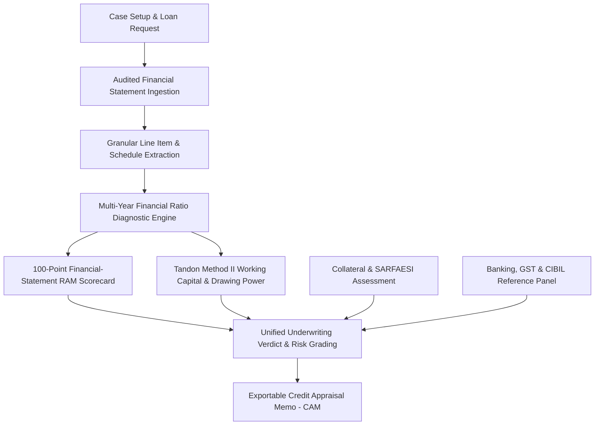

# 📊 Executive Investor Pitch Deck

# **Credalytix: Working Capital Eligibility Calculator**
*Intelligent Commercial Credit Underwriting, RAM Scorecard & MPBF Appraisal Suite*

---

## 🎯 Slide 1: Executive Summary & Vision

- **Company Vision:** Standardizing and automating commercial credit underwriting for banks, NBFCs, and institutional lenders worldwide.
- **Product Stage:** **Active Testing & Pilot Phase** (Undergoing stress testing, financial ratio validation, and pilot evaluations with partner lenders).
- **What We Do:** An automated, audit-grade B2B credit appraisal platform that ingests multi-year financial statements, computes institutional financial ratios, evaluates a 100-point calibrated RAM Scorecard, calculates regulatory Working Capital (MPBF) limits, and generates boardroom-ready Credit Appraisal Memos (CAM).
- **Core Value:** Reduces commercial loan Turnaround Time (TAT) from **14 days to under 15 minutes** while eliminating underwriting calculation errors and standardizing credit risk decisions.

---

## 🛑 Slide 2: The Multi-Billion Dollar Problem

Commercial credit appraisal for SMEs and mid-market corporates remains heavily manual, slow, and error-prone across financial institutions.

```
┌───────────────────────────┐      ┌───────────────────────────┐      ┌───────────────────────────┐
│     Pain Point 1          │      │     Pain Point 2          │      │     Pain Point 3          │
│ Long TAT (14-21 Days)     │  ──► │ Subjective Risk Analysis  │  ──► │ Disconnected Compliance   │
│ Manual data spreading of  │      │ Unstandardized scorecards │      │ Banking, GST, and CIBIL   │
│ balance sheets & schedules│      │ lead to hidden NPAs and   │      │ data reviewed in silos    │
│ delays loan disbursement. │      │ missed credit signals.    │      │ with no audit trail.      │
└───────────────────────────┘      └───────────────────────────┘      └───────────────────────────┘
```

- **Operational Drag:** Credit managers spend over 70% of their bandwidth copying numbers from audited balance sheet PDFs into fragile Excel spreadsheets.
- **Underwriting Inconsistency:** Credit approvals vary widely across branches and analysts for identical risk profiles.
- **Opportunity Loss:** Lengthy processing causes prime borrowers to defect to faster lenders, causing massive interest income leakage.

---

## 💡 Slide 3: The Solution — Credalytix Engine

An institutional-grade credit appraisal suite that automates the end-to-end commercial underwriting lifecycle:

1. **Automated Multi-Year Financial Spreading:** Instantly extracts Balance Sheet, P&L, and Granular Schedules (Debtors, Inventory, Fixed Assets, CWIP, Debt profile) across FY-2, FY-1, and FY.
2. **Proprietary Multi-Pillar RAM Scorecard:** Evaluates borrowers across Financial Performance & Cash Flow, Capital Structure & Solvency, and Business Fundamentals & Efficiency.
3. **Regulatory Working Capital (MPBF) Engine:** Implements Tandon Committee Method II & Turnover Method for precise drawing power and working capital assessment.
4. **Instant Boardroom CAM Generation:** Generates comprehensive, exportable Credit Appraisal Memos and credit verdicts with a complete verifiable audit trail.

---

## 📊 Slide 4: Market Opportunity & TAM

The addressable market spans commercial banks, NBFCs, private credit funds, and digital lending platforms globally.

| Segment | Market Scope | Opportunity Size |
| :--- | :--- | :--- |
| **Total Addressable Market (TAM)** | Global Commercial & SME Lending Software Market | **$16.8 Billion** by 2028 (CAGR: 18.2%) |
| **Serviceable Available Market (SAM)** | India & APAC Commercial Banking / SME Credit | **$4.2 Billion** annual software spend |
| **Serviceable Obtainable Market (SOM)** | Tier-1 & Tier-2 Banks, NBFCs, FinTech Lenders | **$350 Million** initial target market |

- **India Context:** Over **$850 Billion+** unmet SME credit demand with increasing regulatory emphasis on automated risk appraisal and digitized credit monitoring.

---

## ⚙️ Slide 5: Product Architecture & Flow



---

## 🏆 Slide 6: Product Demonstration & Core Modules

### 1. Case Vault & Centralized Pipeline
- Search, filter, and review active, approved, or flagged borrower cases with one-click access.

### 2. Multi-Year Ratio Diagnostics
- Real-time sanity checks on Balance Sheet equality ($Assets = Liabilities + Equity$).
- Dynamic calculation of Liquidity (Current Ratio, Quick Ratio), Leverage (TOL/ATNW, Debt/Equity), Solvency (DSCR, ISCR), and Efficiency (Debtor Days, Inventory Days, ROCE).

### 3. Smart Document Completeness & Fallback Engine
- Intelligent detection of available audited schedules.
- Enables complete RAM scoring even if supplementary schedules are missing by applying calibrated fallback models with proactive recommendations.

---

## 🚀 Slide 7: Quantifiable Business Impact & ROI

| Metric | Traditional Underwriting | With Credalytix | Improvement |
| :--- | :--- | :--- | :--- |
| **Turnaround Time (TAT)** | 14 – 21 Days | **< 15 Minutes** | **95% Faster** |
| **Appraisal Capacity** | ~15 cases / underwriter / mo | **120+ cases / mo** | **8x Productivity** |
| **Calculation Accuracy** | Prone to human spreadsheet errors | **100% Deterministic** | **Zero Calculation Errors** |
| **Policy Compliance** | Variable branch adherence | **Enforced Systematic Rules** | **100% Policy Integrity** |
| **Cost per Loan File** | $450 – $750 | **$45 – $75** | **90% Cost Reduction** |

---

## 💼 Slide 8: Business & Monetization Model

1. **Enterprise B2B SaaS (Banks & Large NBFCs):**
   - Annual platform license tiered by underwriter seats and loan book size ($50,000 – $250,000 / year).
   - Dedicated on-premises or private cloud deployment for scheduled commercial banks.
2. **Usage-Based / Per-Appraisal API Tier (Fintechs & DSAs):**
   - $10 – $35 per completed credit appraisal with full CAM export.
3. **Professional Services & Custom Policy Engineering:**
   - Tailored bank-specific credit risk weighting and custom policy gates.

---

## 🛡️ Slide 9: Competitive Advantages & Moat

- **Zero-Hallucination Deterministic Engine:** Unlike pure LLM wrappers that fabricate financial ratios, our core engine uses verified mathematical algorithms and banking rules.
- **Indian Banking & Regulatory Calibration:** Native support for Tandon Committee Method II, Nayak Committee turnover models, MCA balance sheet schedules, and SARFAESI collateral haircuts.
- **Smart Fallback Architecture:** Appraises loans reliably even with partial schedule documentation, removing deal roadblocks.
- **Cross-Platform Readiness:** Modern responsive interface built for desktop credit committees, tablet field visits, and core banking integration.

---

## 📈 Slide 10: Product Roadmap & Milestones

- **Phase 1 (Completed):** 100-Point RAM Scorecard, Tandon MPBF calculator, multi-year ratio diagnostics, schedule fallback engine, and interactive report generator.
- **Phase 2 (Current):** Centralized case vault persistence, instant PDF/CAM export, and multi-tenant bank user roles.
- **Phase 3 (Next 6 Months):** Direct API integrations with Account Aggregator (AA) framework, MCA-21 company filings, and GSTN portal.
- **Phase 4 (Next 12 Months):** Early Warning System (EWS) for ongoing portfolio monitoring and loan covenants tracking.

---

## 👥 Slide 11: Team & Execution Capabilities

- **Deep Engineering & Architecture Expertise:** Built with a focus on institutional reliability, deterministic mathematics, and modern enterprise user experience.
- **Domain Focus:** Bridging the gap between traditional banking credit policy and modern cloud software.

---

## 🤝 Slide 12: Investment Ask & Use of Funds

- **Target Raise:** Seed / Pre-Series A Round.
- **Allocation of Funds:**
  - **50% Engineering & Product:** Account Aggregator (AA) integrations, automated OCR/spreading models, Early Warning System (EWS).
  - **30% Enterprise Sales & Pilot Deployments:** Establishing pilot programs with Tier-1/Tier-2 NBFCs and commercial banks.
  - **20% Regulatory Compliance & Security:** SOC2 Type II, ISO 27001, and banking infrastructure certifications.

---

*Contact: Abhishek Bhatnagar — abhi.bhatnagar2593@gmail.com*  
*GitHub Profile: [github.com/bhatnagar-built](https://github.com/bhatnagar-built)*
